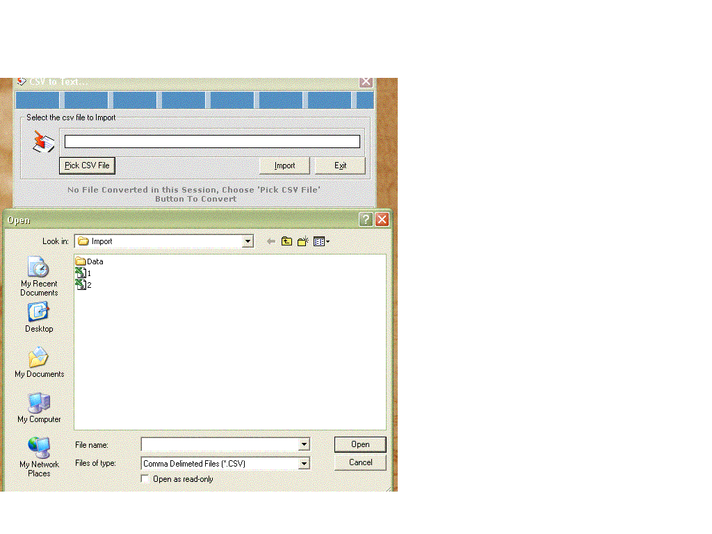



## CSV to Text Converter

### Description

I will be soon giving you with the new version of it only if the response is good.

Email me your suggestions and feedback @ universalprogrammer@indiatimes.com

Title: CSV to Text File Converter.

Description: I thought of sharing this program with you all. Converting CSV files to Text Files as per customisation required. I was using this small project to convert the CSV file i have into different text files. The name of the text file use to be the same as the first column in the csv. Rest all corresponding data goes to the subsequent files and gets append to it.

For Example : when i run three different CSV's then all the for the first column named "UNIVERSAL" gets logged into one text file named UNIVERSAL.txt.... similar others data are getting appended.

01/01/2003,81,81.5,79.3,80,9848

01/06/2003,81,81.5,79.3,80,9848

02/06/2003,81,81.5,79.3,80,9848

----

I will be soon giving you with the new version of it only if the response is good.

Email me your suggestions and feedback @ universalprogrammer@indiatimes.com
 
### More Info
 
Steps to Convert :

1) Open the VB Project.

2) Select the CSV file named "1.csv" provided in the zip using "Pick CSV button" and then click on the "import Button".

3) Once you click the "Import Button" a new folder named "Data" with corresponding text files as of the csv's first column will be available.

4) Similarly follow the steps for CSV "2.csv" and you find that only corresponding data gets appended in the text file. That means if the CSV file has first column "universal" and all the data from csv with first column as "universal" will get appended in the text file "Universal.txt"

I will be soon giving you with the new version of it only if the response is good.

Email me your suggestions and feedback @ universalprogrammer@indiatimes.com

             |
---                |---
**Submitted On**   |2003-11-22 18:52:08
**By**             |[Universal Kida](https://github.com/Planet-Source-Code/PSCIndex/blob/master/ByAuthor/universal-kida.md)
**Level**          |Intermediate
**User Rating**    |4.9 (44 globes from 9 users)
**Compatibility**  |VB 6\.0
**Category**       |[Complete Applications](https://github.com/Planet-Source-Code/PSCIndex/blob/master/ByCategory/complete-applications__1-27.md)
**World**          |[Visual Basic](https://github.com/Planet-Source-Code/PSCIndex/blob/master/ByWorld/visual-basic.md)
**Archive File**   |[CSV\_to\_Tex1702191312004\.zip](https://github.com/Planet-Source-Code/universal-kida-csv-to-text-converter__1-51388/archive/master.zip)

